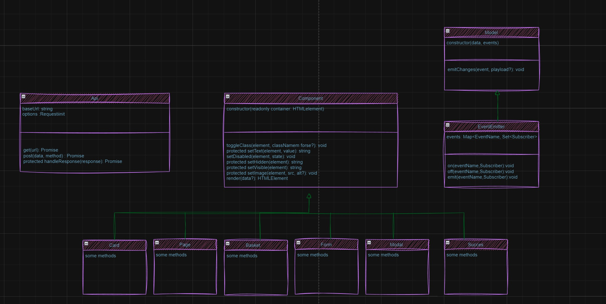

# Проектная работа "Веб-ларек"

Стек: HTML, SCSS, TS, Webpack

Структура проекта:
- src/ — исходные файлы проекта
- src/components/ — папка с JS компонентами
- src/components/base/ — папка с базовым кодом

Важные файлы:
- src/pages/index.html — HTML-файл главной страницы
- src/types/index.ts — файл с типами
- src/index.ts — точка входа приложения
- src/scss/styles.scss — корневой файл стилей
- src/utils/constants.ts — файл с константами
- src/utils/utils.ts — файл с утилитами

## Установка и запуск
Для установки и запуска проекта необходимо выполнить команды

```
npm install
npm run start
```

или

```
yarn
yarn start
```
## Сборка

```
npm run build
```

или

```
yarn build
```
Архитектура(в 9 ПР работе ЕР-модель доделается с учетом API):


Данные и типы данных:
-Интерфейс для данных каточки товара (в таком виде данные приходят с сервера).

```
interface ICard {
  id: string;
  description: string;
  image: string;
  title: string;
  category: string;
  price: number; 
}
```
-Интерфейс для модели данных карточек(товаров).
```
interface ICardsData {
  set cards(cards: ICard[]);
  get cards(): ICard[];
  getCard(id: string): ICard | undefined;
}
```
-Интерфейс для модели данных корзины.
```
interface IBasketModel {
  add(item: ICard): void;
  remove(id: string): void;
  clear(): void;
  getTotal(): number;
  getTotalPrice(): number;
  getIds(): string[];
  isEmpty(): boolean;
  contains(id: string): boolean;
}
```
-Тип данных метода оплаты.
```
type TPaymentMethod = '' | 'card' | 'cash';
```
-Интерфейс данных заказа.
```
interface IOrderDetails {
  payment: TPaymentMethod;
  email: string;
  phone: string;
  address: string;
}
```
-Интерфейс для модели данных заказа.
```
interface IOrderModel {
  set payment(payment: TPaymentMethod); 
  set email(email: string);
  set phone(phone: string);
}
```

-Интерфейс для отображения главной страницы.
```
interface IPage {
  set counter(value: number);
  set catalog(items: HTMLElement[]);
  set locked(value: boolean);
  get basket(): HTMLElement;
}
```
-Интерфейс для отображения модального окна.
```
interface IModal {
  set content(value: HTMLElement)
	open(): void;
	close(): void;
}
```
-Интерфейс для отображения карточки.
```
interface ICardView {
  render(data: ICard, index?: number, basketIds?: string[]): HTMLElement;
}
```
-Интерфейс для отображения корзины.
```
interface IBasketView {
  render(data: { items: HTMLElement[]; price: number; isEmpty: boolean }): HTMLElement;
}
```
-Интерфейс для отображения форм.
```
interface IFormView {
  render(...args: any[]): HTMLElement;
}
```
-Интерфейс для отображения успешного заказа.
```
interface ISuccess {
  render(total: number): HTMLElement;
}
```